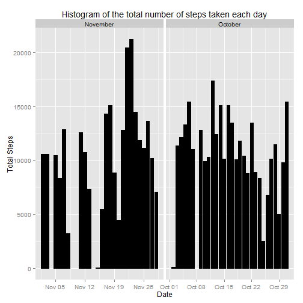

## Setting Global Options

```r
opts_chunk$set(echo=TRUE)
```

## Loading and preprocessing the data
* Loading the data

```r
movement_data <- read.csv(unzip("activity.zip"), header=TRUE, colClasses=c("integer", "Date", "integer"))
```
* Additional processing for analysis

```r
mdata <- na.omit(movement_data)
mdata$month <- format(mdata$date, format="%B")
options(scipen=999) #Turn off scientific notation
library(ggplot2)
```

## What is mean total number of steps taken per day?
* Make a histogram of the total number of steps taken each day

```r
ggplot(mdata, aes(date, steps)) + 
  geom_bar(stat = "identity", colour = "black", fill = "black", width = 0.8) + 
  facet_grid(. ~ month, scales = "free") + 
  labs(x = "Date", y = "Total Steps", title = "Histogram of the total number of steps taken each day")
```

 

* Calculate and report the mean and median total number of steps taken per day

```r
steps <- aggregate(mdata$steps, list(Date = mdata$date), FUN = "sum")$x
steps_mean <- mean(steps)
steps_median <- median(steps)
```
Mean is 10766.1886792  
Median is 10765

## What is the average daily activity pattern?


## Imputing missing values


## Are there differences in activity patterns between weekdays and weekends?
